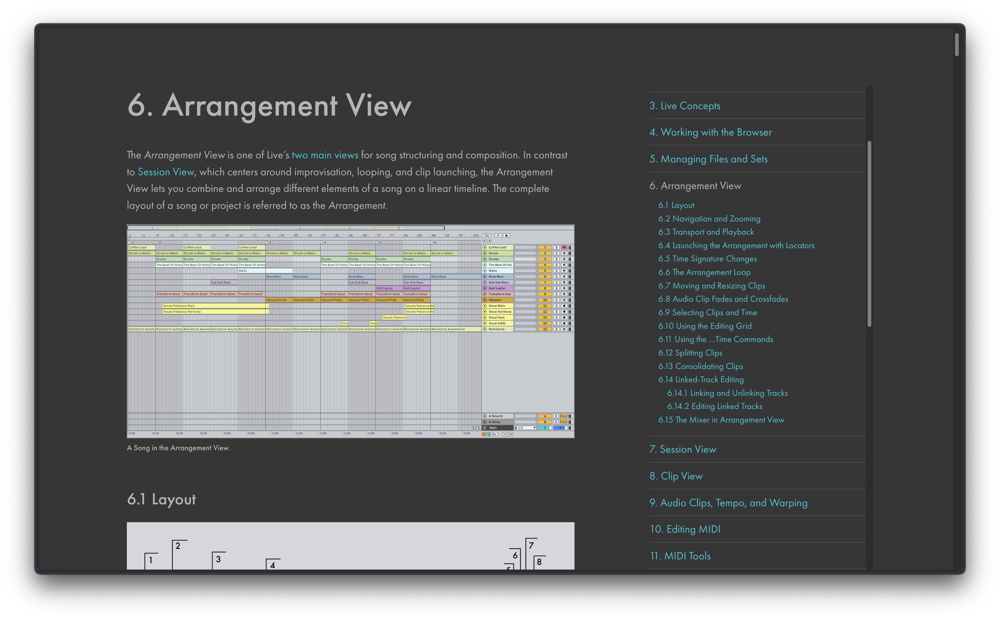

# Ableton Live Reference Manual Enhanced Theme

Custom style for the online version of [Ableton Live's user manual](https://www.ableton.com/en/live-manual/12/), including a fixed table of contents and optional dark theme.

# How to use

1. Install the Stylus browser extension for [Chrome/Chromium-based browsers](https://chromewebstore.google.com/detail/stylus/clngdbkpkpeebahjckkjfobafhncgmne?pli=1) or [Firefox](https://addons.mozilla.org/en-US/firefox/addon/styl-us/).
2. Add the style by clicking the badge below.

Link to the manual: [Ableton Live Reference Manual](https://www.ableton.com/en/live-manual/12/)

## Configuring theme options

To adjust theme options, click the Stylus extension button in your browser's toolbar:

Click the gear icon next to the theme to see the options:

Click _Save_ after adjusting options.
