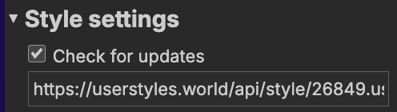

# Ableton Live Reference Manual Enhanced Theme

Custom style for the online versions of Ableton’s user manuals for [Live](https://www.ableton.com/en/live-manual/12/), [Push](https://www.ableton.com/en/push/manual/), [Move](https://www.ableton.com/en/move/manual/) and [Note](https://www.ableton.com/en/note/manual/). Options include a fixed/sticky table of contents sidebar, dark theme, and hiding the website’s header and footer.

# How to use

1. Install the Stylus browser extension for [Chrome/Chromium-based browsers](https://chromewebstore.google.com/detail/stylus/clngdbkpkpeebahjckkjfobafhncgmne?pli=1) or [Firefox](https://addons.mozilla.org/en-US/firefox/addon/styl-us/).
2. Add the style by clicking the badge below.

Link to the manuals: 
[Ableton Live manual](https://www.ableton.com/en/live-manual/12/) • [Ableton Push 3 manual](https://www.ableton.com/en/push/manual/) • [Ableton Move manual](https://www.ableton.com/en/move/manual/)
 • [Ableton Note manual](https://www.ableton.com/en/note/manual/)

## Updating the theme

The theme should automatically update if you have the “Check for updates” option enabled in the “Edit Style” window for the theme:

You can also manually update (i.e., reinstall) the theme at any time by clicking the “Install directly with Stylus” badge:

Details on new releases can be found [here](https://github.com/allenmp3/ableton-live-manual-enhanced-css/releases).

## Configuring theme options

To adjust theme options, click the Stylus extension button in your browser’s toolbar:

Click the gear icon next to the theme to see the options:

Click _Save_ after adjusting options.

# Other notes

Extension works for the manuals in all supported languages. As of 2026-03-02, these are: 
 * `en` (English) — Live, Push, Move, Note
 * `de` (Deutsch) — Push, Move, Note
 * `fr` (français) — Push, Move, Note
 * `ja` (日本語) — Push, Move, Note
 * `zh-cn` (简体中文) — Push, Move, Note
 * `es` (español) — Push, Move
 * `it` (italiano) — Push, Move
